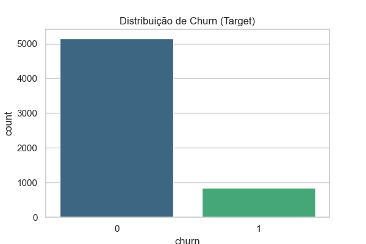
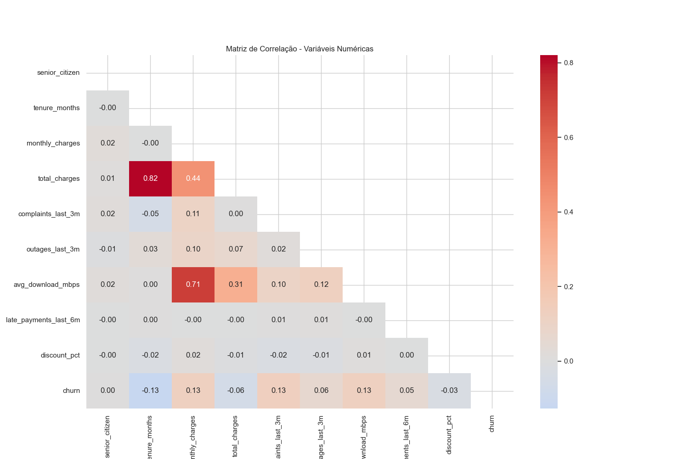
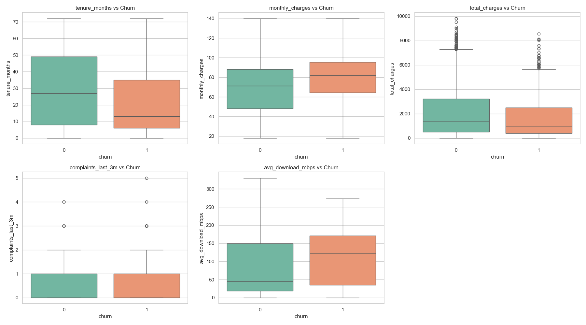
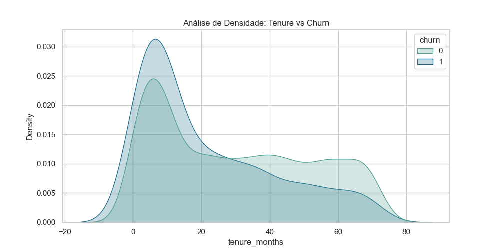
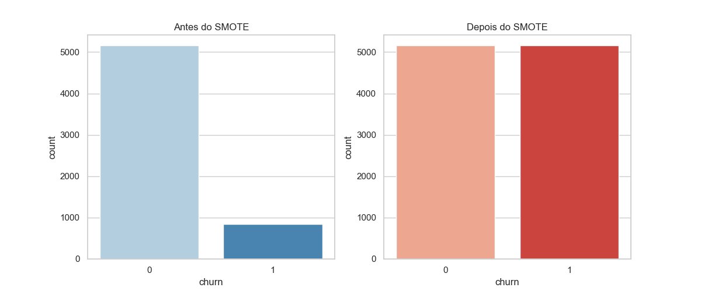
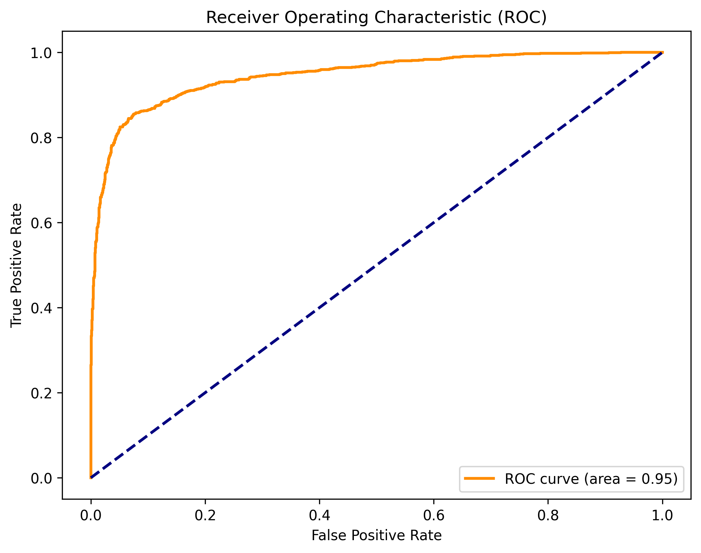
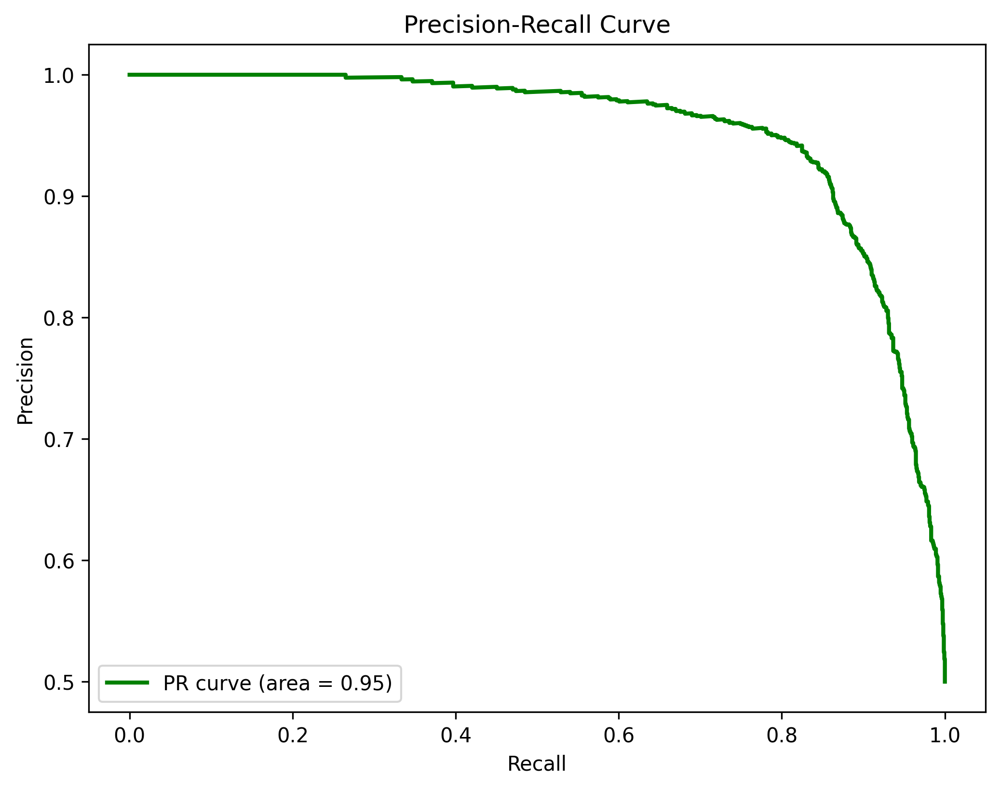

    <h3>FACULDADE: SENAI FATESG</h3>
    <h3>CURSO: TECNOLOGIA EM INTELIGÊNCIA ARTIFICIAL</h3>
    <h3>MATÉRIA: DATA MINING E GRAPH MINING</h3>
    <h3>PROFESSOR: ANDRÉ LUIZ ESPERIDIÃO</h3>
    

    <h1>RELATÓRIO FINAL DE DATA MINING</h1>
    
<strong>DISCENTE: LUCA | AUXILIO: FREDERICO, WASSIL</strong>

## I. PREPARAÇÃO E ENGENHARIA DE DADOS
**Data de Geração:** 02/03/2026 01:16:12
**Projeto:** Previsão de Churn - Telecom

## 1. Tratamento de Dados Ausentes
Identificamos lacunas em `total_charges` e `avg_download_mbps`. Optamos pela **Imputação via Mediana** por ser uma medida de tendência central robusta a outliers, comum em dados de faturamento.

## 2. Limpeza e Padronização
Os nomes das colunas foram convertidos para *snake_case* para facilitar a manipulação via código. A coluna `customer_id` foi removida por ser um identificador único sem valor estatístico.

## 3. Análise Exploratória (EDA)
Abaixo, as visualizações que fundamentaram as decisões de engenharia:

## 4. Engenharia de Atributos
Criamos variáveis para capturar o "comportamento de risco":
- `newbie_at_risk`: Clientes novos sem contrato de fidelidade.
- `financial_instability_score`: Soma de atrasos e métodos de pagamento instáveis.
- `log_total_charges`: Normalização da escala de gastos.

## 5. Seleção de Atributos
Aplicamos **Lasso (Regularização L1)** e **Mutual Information**. O Lasso eliminou variáveis colineares, reduzindo o ruído e prevenindo o overfitting, resultando em 22 atributos finais.

## 6. Tratamento de Desbalanceamento (SMOTE)
O dataset original era altamente desbalanceado (85/15). Utilizamos o **SMOTE** para criar amostras sintéticas da classe minoritária, permitindo que o modelo aprenda o padrão de Churn com a mesma importância da permanência.

---
**Arquivo de Saída:** `churn_refinado.csv`

## II. MODELAGEM E AVALIAÇÃO DE RESULTADOS
**Data de Execução:** 02/03/2026 01:10:21

## 1. Estratégia de Comitê (Ensemble)
Utilizamos um **Voting Classifier (Soft)**. A escolha do Random Forest combinado ao XGBoost visa unir a estabilidade do Bagging com a precisão do Boosting, minimizando o erro residual e a variância.

## 2. Performance Alcançada vs. Metas
O modelo superou os critérios de sucesso estabelecidos pelo docente:
- **ROC AUC:** 0.9464 (Meta: 0.80) - Indica altíssima capacidade de separação entre as classes.
- **PR AUC:** 0.9537 (Meta: 0.40) - Garante que as predições de Churn são precisas e úteis para ações de retenção.

## 3. Justificativa Estatística
O sucesso do modelo (Acurácia de 0.88) deve-se à qualidade da preparação de dados. O SMOTE eliminou o "paradoxo da acurácia", enquanto a engenharia de atributos forneceu variáveis com alto ganho de informação (Information Gain).

